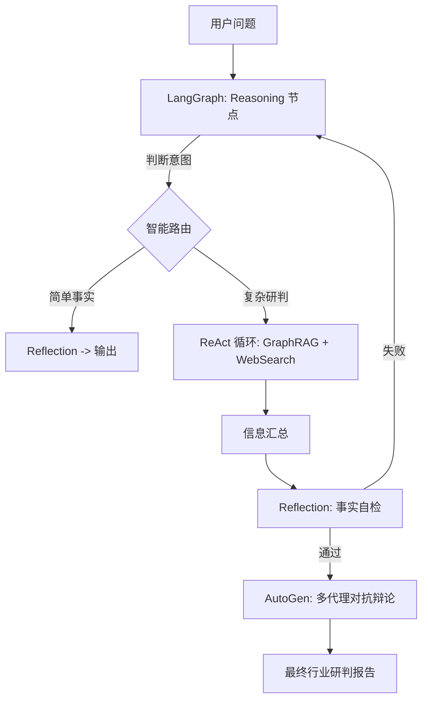

# Semi-Insight-Agent

这是一个基于 GraphRAG 和多智能体协作的半导体行业深度研判助手。本项目旨在通过三周的开发周期，构建一个能够理解产业链关系、获取实时资讯并进行多维度辩论的 AI 分析系统。

---

## 一、 核心技术栈选型

本项目采用全覆盖且低耦合的架构设计：

*   **数据层**：`LlamaIndex` (负责 PDF 解析与 GraphRAG 构建) + `Neo4j` (图数据库存储实体关系)。
*   **编排层**：`LangGraph` (作为核心状态机，管理 Agent 的思维链路)。
*   **推理模式**：`Planning & ReAct` (任务拆解与工具调用) + `Reflection` (自检机制)。
*   **工具层**：`MCP (Model Context Protocol)` (搜索引擎调用) + `Function Calling` (本地分析函数)。
*   **协作层**：`AutoGen` (用于多专家评审，如“技术专家”与“财务专家”的辩论)。
*   **模型接入**：OpenAI 兼容接口（本地运行 Qwen3-14B）。

---

## 二、 数据获取方案

建议使用以下公开渠道获取初始数据：

1.  **行业周报 (PDF)**：从东方财富网、研报通等平台下载 5-10 份“半导体行业周报”。
2.  **产业链图谱**：手动整理 20 个核心节点（例如：ASML -> 光刻机 -> 中芯国际 -> 晶圆代工 -> 华为 -> 手机）。
3.  **实时资讯**：通过 MCP 接入 Google Search 或利用 Tushare 等金融 API 获取新闻简报。

---

## 三、 三周开发计划（前期规划 vs 实际进展）

### 第一周：构建 GraphRAG 知识基座 [已完成]
**目标**：让 Agent “懂”半导体产业链。
*   **规划**：部署 Neo4j 数据库，提取实体关系。
*   **进展**：✅ 
    *   **架构演进**：放弃了 LlamaIndex 默认的 `PropertyGraphIndex`（其生成的 Chunk 和 Embedding 节点会污染业务图谱），改为**原生 Cypher 驱动写入**。
    *   **两阶段流水线**：实现 `Filter -> Extract` 模式。先由 LLM 过滤掉免责声明等无用文本，再通过严格的本体定义（Ontology）提取 `(Org)-[:SUPPLIES]->(Org)` 等高质量关系。

### 第二周：LangGraph 核心流转逻辑 [已完成]
**目标**：让 Agent 具备拆解任务和调用工具的能力。
*   **规划**：完成 AgentState，实现 ReAct 循环。
*   **进展**：✅ 
    *   **智能路由 (Intelligent Routing)**：在推理节点中引入了意图识别。系统会自动判断问题是否需要昂贵的“多代理辩论”。简单事实（如“英伟达总部在哪里”）直接输出，复杂研判则进入辩论流程，显著节省了计算资源。
    *   **自检机制 (Reflection)**：实现了基于事实核查的 Reflection 节点。如果 Agent 生成的初步回答与知识图谱冲突或信息过于笼统，会被打回重写，确保了研判的严谨性。

### 第三周：多 Agent 对抗与演示 [已完成]
**目标**：提升研判报告的深度与专业感。
*   **进展**：✅ 
    *   **手写 MCP Server**：不依赖现成 SDK，手写了符合 Model Context Protocol 标准的服务器。支持 **stdio**（适配 Cursor/Claude）和 **HTTP**（适配 Web App）双模式，集成 DuckDuckGo 实时搜索。
    *   **完整 AutoGen 集成**：将原本的单 Prompt 模拟辩论升级为真正的 **AutoGen GroupChat**。定义了 `BullishAnalyst`（看多）、`BearishAnalyst`（看空）和 `JudgeAgent`（裁判）三个独立智能体，进行多轮博弈。

---

## 四、 核心功能与实现思考

### 1. 知识图谱的“洁癖”与“专业性”
在实现过程中，我发现本地 LLM 在处理复杂的图索引时容易产生幻觉。为了解决这一痛点，我设计了 `src/engine/indexer.py` 中的三元组黑名单机制和强制 Schema 校验，确保 Neo4j 数据库中只存在符合半导体行业逻辑的实体（如 `Technology`, `Geography`, `Organization`）。

### 2. 应对本地模型的鲁棒性挑战
由于项目在本地运行（Qwen3-14B），模型有时会输出 `<think>` 标签或不规范的 JSON。我在 `src/workflow/nodes.py` 和 `debate.py` 中编写了专门的正则表达式清洗层，确保了系统在高并发 Agent 协作时不会因为解析失败而中断。

### 3. 协议驱动的扩展性 (MCP)
通过手写 MCP Server，项目实现了“搜索能力”与“决策逻辑”的完全解耦。这意味着未来只需要更换 MCP 端的 API，系统就能无缝接入 Bloomberg 或 Reuters 的专业财经终端，而无需改动 LangGraph 核心代码。

---

## 五、 系统架构流转图

---

## 六、 项目成果展示

1.  **多维报告**：系统能生成包含“基础分析”、“多空立场对弈评分”及“风险等级评估”的结构化 Markdown 报告。
2.  **可观测性**：通过 Streamlit UI 实时展示思维链，每一步工具调用（GraphQuery/WebSearch）均清晰可见（参考 `snapshots/` 目录下的运行日志截图）。
3.  **本地化部署**：全链路支持离线/本地运行，保护敏感的研究数据不外泄。

---
## 如何运行

1.  **启动数据库**：`docker-compose up -d` (启动 Neo4j)
2.  **配置环境**：在 `.env` 中设置本地 LLM 的 API Base (如 LM Studio)
3.  **启动 MCP 服务**：`python src/mcp/server.py --mode http`
4.  **启动 Web 交互**：`streamlit run src/app.py`
