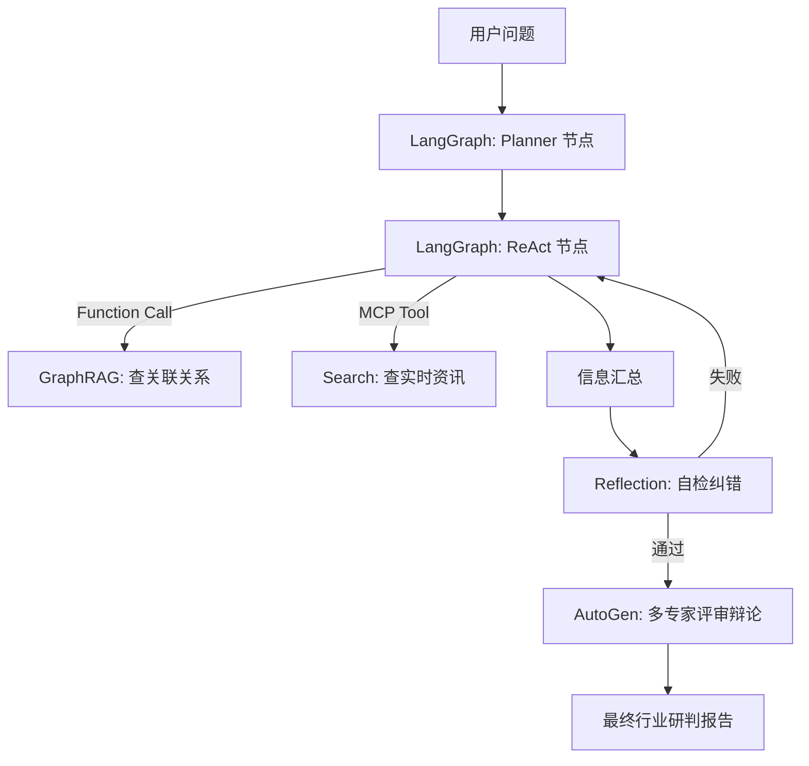

# Semi-Insight-Agent

这是一个基于 GraphRAG 和多智能体协作的半导体行业深度研判助手。本项目旨在通过三周的开发周期，构建一个能够理解产业链关系、获取实时资讯并进行多维度辩论的 AI 分析系统。

---

## 一、 核心技术栈选型

本项目采用全覆盖且低耦合的架构设计：

*   **数据层**：`LlamaIndex` (负责 PDF 解析与 GraphRAG 构建) + `Neo4j` (图数据库存储实体关系)。
*   **编排层**：`LangGraph` (作为核心状态机，管理 Agent 的思维链路)。
*   **推理模式**：`Planning & ReAct` (任务拆解与工具调用) + `Reflection` (自检机制)。
*   **工具层**：`MCP (Model Context Protocol)` (搜索引擎调用) + `Function Calling` (本地分析函数)。
*   **协作层**：`AutoGen` (用于多专家评审，如“技术专家”与“财务专家”的辩论)。
*   **模型接入**：OpenAI 兼容接口。

---

## 二、 数据获取方案

建议使用以下公开渠道获取初始数据：

1.  **行业周报 (PDF)**：从东方财富网、研报通等平台下载 5-10 份“半导体行业周报”。
2.  **产业链图谱**：手动整理 20 个核心节点（例如：ASML -> 光刻机 -> 中芯国际 -> 晶圆代工 -> 华为 -> 手机）。
3.  **实时资讯**：通过 MCP 接入 Google Search 或利用 Tushare 等金融 API 获取新闻简报。

---

## 三、 三周开发计划

### 第一周：构建 GraphRAG 知识基座 [已完成]
**目标**：让 Agent “懂”半导体产业链。
*   部署 Neo4j 数据库（推荐 Docker）。
*   **核心实现**：自定义 `Two-Stage Pipeline` 提取公司（Entity）及其关系。
*   **技术栈变更**：放弃 `PropertyGraphIndex`，改用 **原生 Cypher** 写入以保证图谱纯净度。
*   **交付标准**：实现基础路径查询（如“美国限制光刻机出口对国产厂商的影响”）。

### 第二周：LangGraph 核心流转逻辑 [已完成]
**目标**：让 Agent 具备拆解任务和调用工具的能力。
*   **State 定义**：完成 `AgentState` 共享内存结构。
*   **ReAct 循环**：实现 `Reasoning` -> `Tool` -> `Reasoning` 的闭环。
*   **核心工具**：构建 **Text-to-Cypher** 引擎，支持自然语言查库。
*   **交互界面**：基于 Streamlit 构建 Web UI，支持实时思维链可视化。

### 第三周：多 Agent 对抗与演示 [进行中]
**目标**：提升研判报告的深度与专业感。
*   **Web 搜索集成**：接入 DuckDuckGo/Tavily 解决知识滞后问题。
*   **AutoGen 集成**：定义 `BullishAgent` (看多) 与 `BearishAgent` (看空)。
*   **辩论流程**：对研判结果进行 2 轮对抗辩论，输出多维深度报告。

---

## 四、 系统架构流转图

